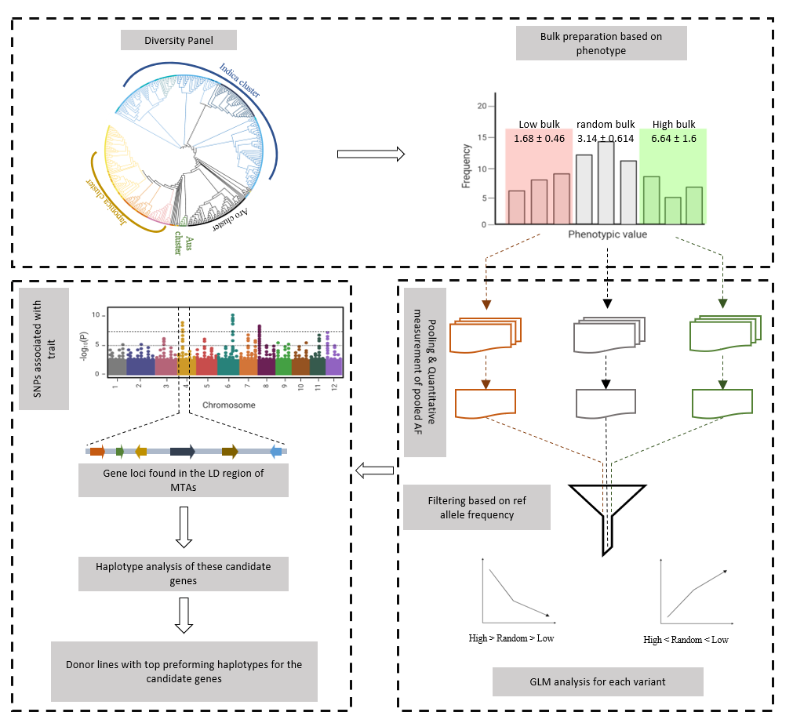

Et-GWAS is an R package for assocaition study that combines extreme bulk pooling and allele frequency measurement to facilitate the detection of associations between genetic variants and target traits. This packages comes two versions, 1) Web tool: This is easier to use. 2) R package: This can be customized by the users. 

# Introduction to method
The Et-GWAS method leverages historical recombination events within a diversity panel to identify rare, high-impact variants associated with the targeted traits. Inspired by the extreme-phenotype GWAS approach, it combines bulk segregant analysis with GWAS, treating the diversity panel as a segregating population. The method uses available genome sequence information to construct extreme pools and a random bulk, representing the genomic variation across the entire diversity panel. The contrasting germplasms are grouped, and allele frequencies are measured to facilitate the detection of marker-trait associations (MTAs). To illustrate the Et-GWAS, we presented a schematic representation in Figure 1, focusing on its application to yield under reproductive stage drought in rice. The analysis involves the following three key steps: 

    1. Sampling: Constructing the diversity panel and bulk preparation based on the trait distribution.
    2. Pooling: Combine the sequence data from the bulks and Quantitative measurement of pooled allele frequency.
    3. Screening: Association analysis and identification of donors with top performing haplotypes
    

Figure 1 The schematic representation of the Et-GWAS pipeline: The workflow consists of three steps, (a) Sampling (b) Pooling of variant information from available sequence data, and (c) Association analysis and identification of donors with top performing haplotypes

# Graphical user interphase of Et-GWAS for Windows
The Et-GWAS application is user-friendly and requires no prior knowledge of R programming. It operates through a graphical user interface (GUI) that guides users through the process. To begin, users input the desired bulk size, trait name, and phenotypic file on the starting page of the application. Comprehensive instructions regarding data formatting can be found in the documentation below. Since the webserver runs with very low density SNP set, the users can upgrate to the "Functional SNP set" for the analysis. This SNP set contains ~30K SNPs from exonic region with effects on the protein structure.

Users can run the app locally through the code “shiny::runGitHub(“Et-GWAS_Windows”, “IRRISouthAsiaHub”)”  in RStudio.

# Webtool and GUI for large Marker data
Full details are given in the repository
https://github.com/IRRI-South-Asia-Hub/Et-GWAS
